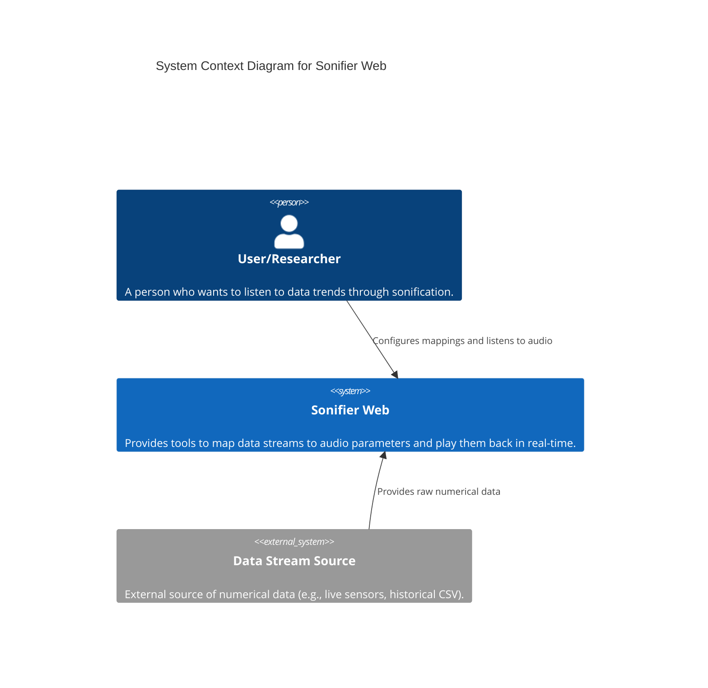
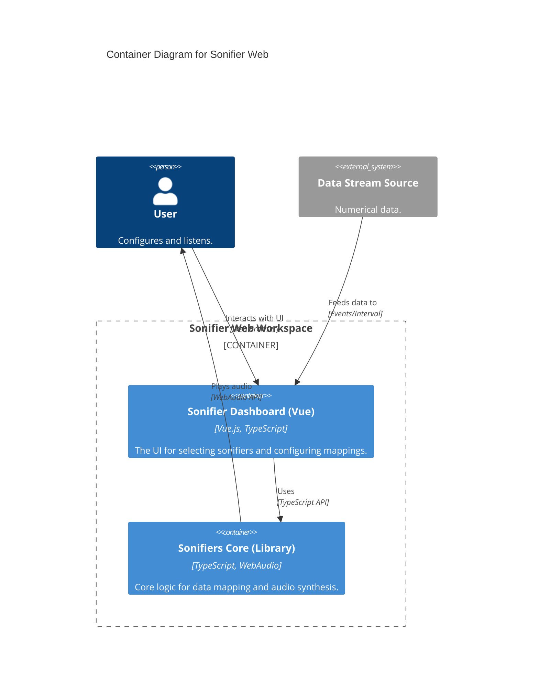
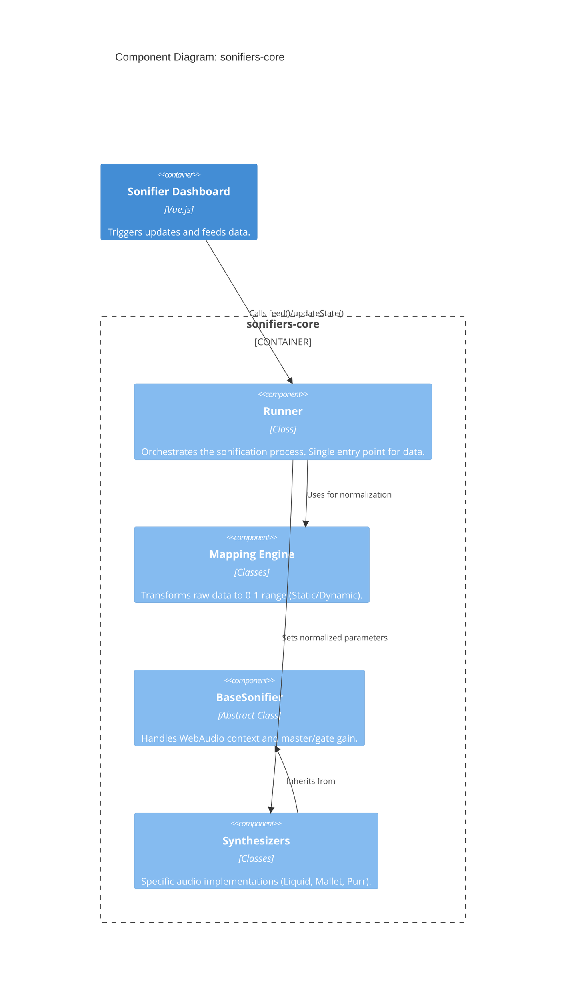

# Sonifier Web Architecture

This document describes the architecture of the Sonifier Web project using the C4 model.

## System Context Diagram

The Sonifier Web system allows users to sonify data streams using various synthesized sounds.

## Container Diagram

The system is divided into a core library and a frontend dashboard.

## Component Diagram (sonifiers-core)

Focusing on the internal structure of the `sonifiers-core` library.

## Data Flow

1. **Input**: `Runner.feed(value)` receives a raw data point.
2. **Mapping**: `Mapping` (Static or Dynamic) converts the value to a `0.0 - 1.0` range.
3. **Dispatch**: `Runner` calls `Sonifier.setParameter(name, normalizedValue)`.
4. **Synthesis**: The `Sonifier` implementation (e.g., `LiquidSynth`) maps the `0-1` value to a physical parameter (e.g., `5Hz - 100Hz`) and updates its `AudioParam`.
