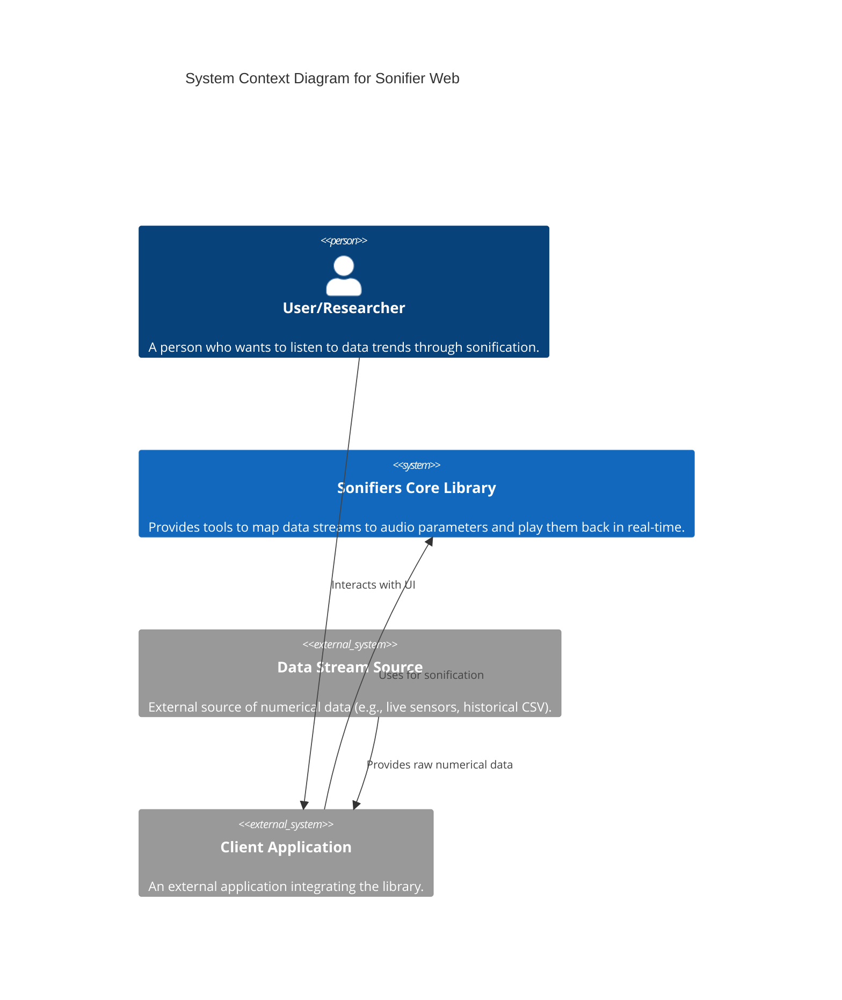
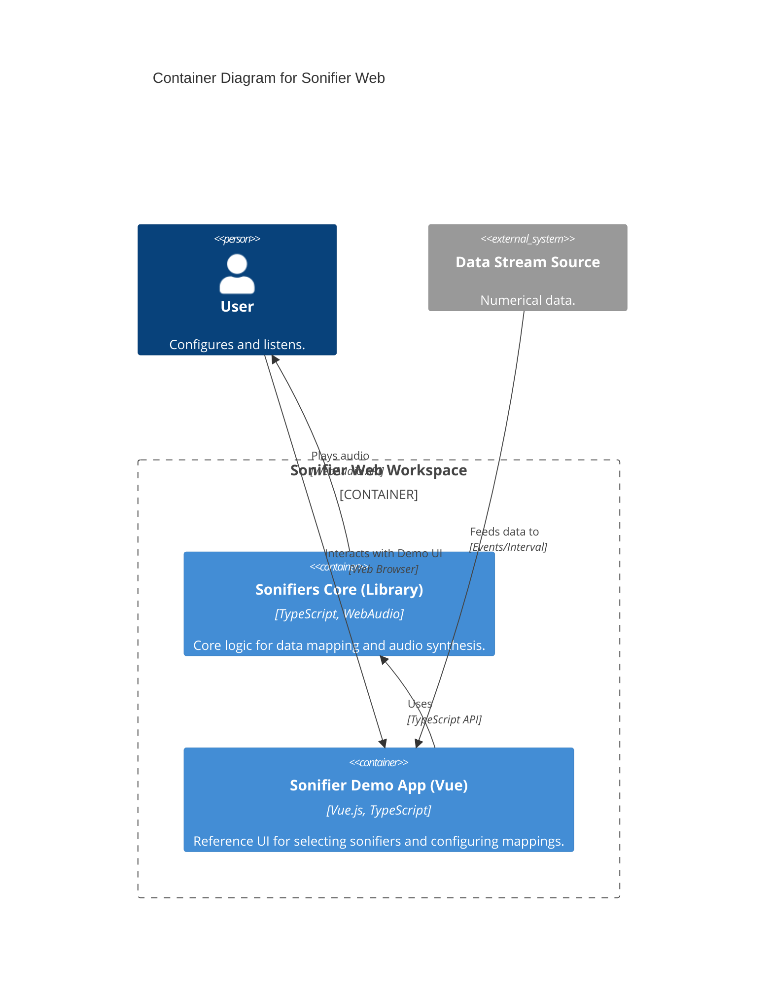
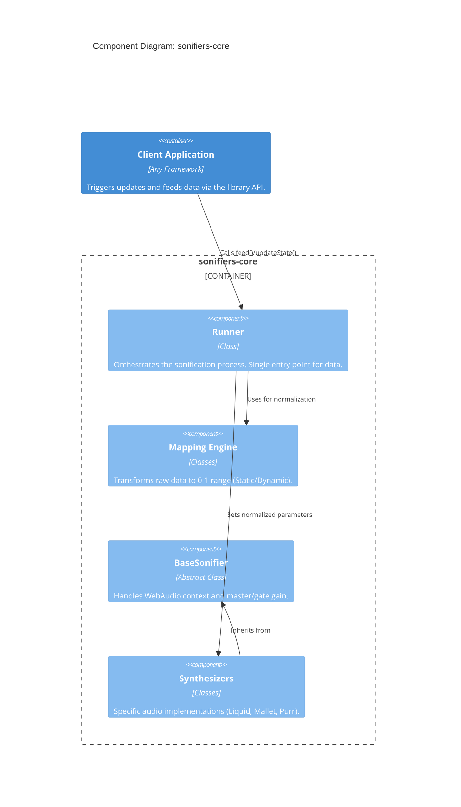

# Sonifier Web Architecture

This document describes the architecture of the Sonifier Web project, distinguishing between the core library and the demonstration application.

## System Context Diagram

The Sonifiers Core Library is the central component, intended to be integrated into various client applications.

## Container Diagram

The monorepo contains the core library and a reference demo application.

## Component Diagram (sonifiers-core)

The `sonifiers-core` library is designed to be framework-agnostic and standalone.

## UI & Integration Boundaries

A key architectural principle of Sonifier Web is the separation of audio logic from user interface.

- **Library Responsibility**: The `sonifiers-core` library handles all audio synthesis, parameter management, and data mapping logic. It exposes a normalized 0-1 interface for all parameters.
- **Client Responsibility**: The client application (whether it's the included `sonifier-app` demo or an external product) is responsible for:
    - Implementing the user interface (sliders, toggles, menus).
    - Managing the application state and data sourcing.
    - Binding UI elements to library parameters via the `Runner` and `SonifierLibrary` APIs.

The `sonifier-app` serves as a comprehensive example of how to implement these client-side responsibilities.

## Data Flow

1. **Input**: `Runner.feed(value)` receives a raw data point.
2. **Mapping**: `Mapping` (Static or Dynamic) converts the value to a `0.0 - 1.0` range.
3. **Dispatch**: `Runner` calls `Sonifier.setParameter(name, normalizedValue)`.
4. **Synthesis**: The `Sonifier` implementation (e.g., `LiquidSynth`) maps the `0-1` value to a physical parameter (e.g., `5Hz - 100Hz`) and updates its `AudioParam`.
