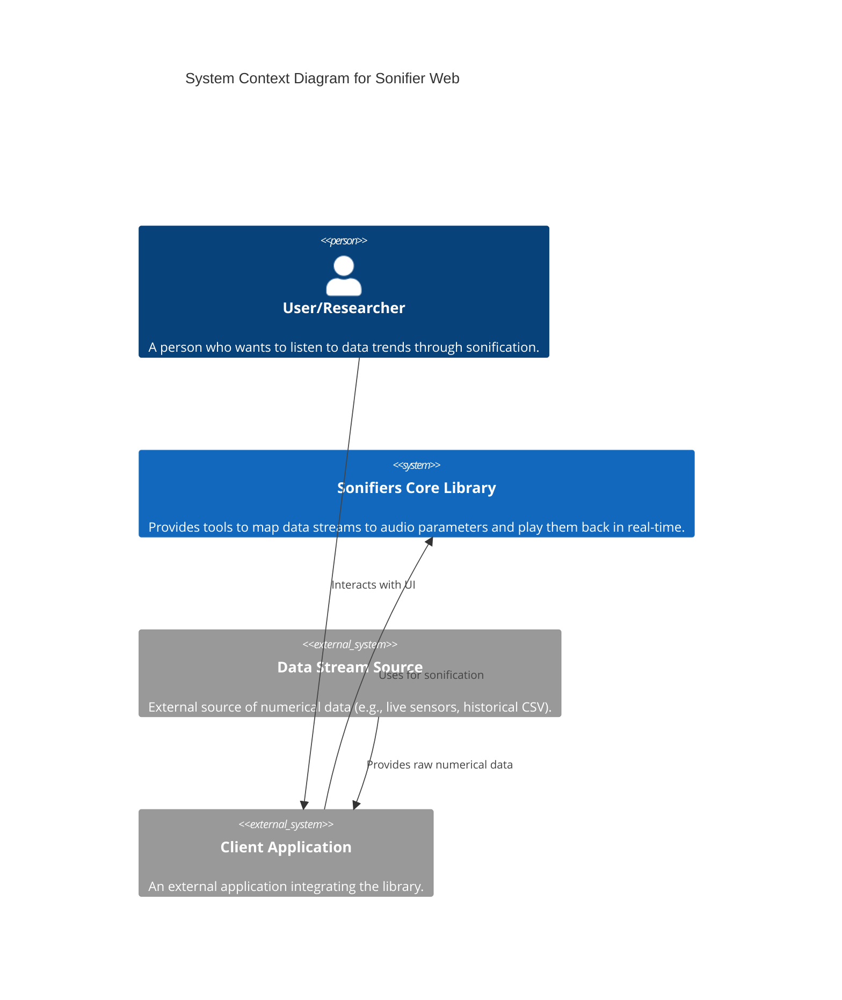
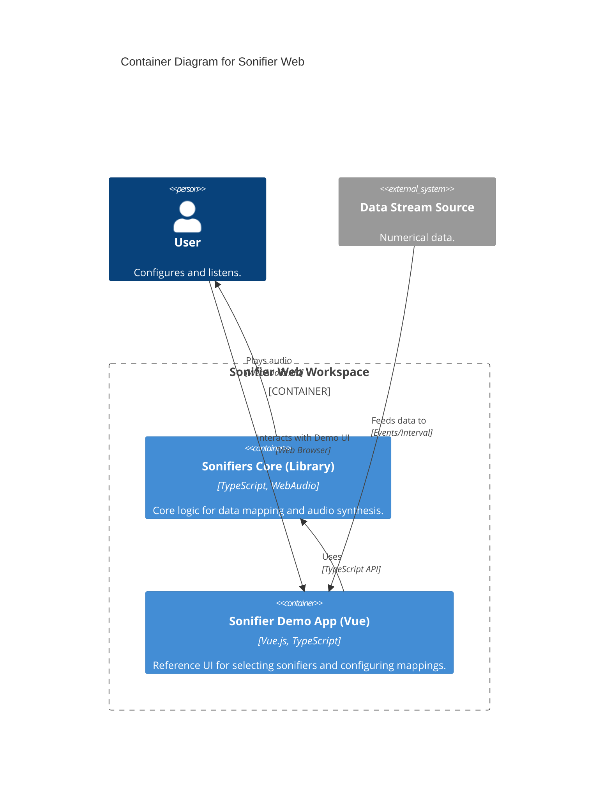

# Sonifier Web

A professional web-based sonification toolkit. The primary product is a standalone library for real-time data sonification, supported by a demo application for configuration and testing.

## Project Structure

This is a monorepo managed with npm workspaces:

- **`packages/sonifiers-core`**: **The Toolkit**. A zero-dependency, TypeScript library for mapping data to WebAudio synthesizers. This is the primary integration point for external clients.
- **`packages/sonifier-app`**: **The Demo**. A sample Vue 3 application that demonstrates the library's capabilities. It serves as a reference implementation and dashboard for testing synths.

> **Note**: Clients of the library are responsible for implementing any user interface required for their specific application (e.g., custom volume sliders, data binding UIs). The library provides the core logic and parameters.

## Architecture

This project follows a modular architecture designed for real-time performance and framework independence. The library (`sonifiers-core`) is strictly decoupled from any UI framework.

### System Context



### Container Diagram



For a deeper dive into the internal components of the library and its relationship with client applications, see the [Architecture Documentation](./ARCHITECTURE.md).

## Features

- **Standardized Audio Engines**: Unified lifecycle and parameter interface for all synths (Liquid, Mallet, Purr).
- **Smart Data Mapping**: High-level `Runner` that handles normalization, statistical scaling (Mean/StdDev), and parameter orchestration.
- **Headless & UI Friendly**: The library is built to be easily integrated into any frontend framework or used headlessly in Node.js/Environments supporting WebAudio.
- **Professional Audio Quality**: Strict initialization rules and optimized synthesis algorithms prevent audible artifacts and ensure high-fidelity sonification.

## Getting Started

### Prerequisites

- Node.js (v18+)
- npm (v9+)

### Installation

```bash
# Clone the repository
git clone <this-repo-url>
cd sonifier-web

# Install dependencies for all workspaces
npm install
```

### Using the Library

Clients should depend on `@sonifier-web/sonifiers-core` (or the local `packages/sonifiers-core` path in this repo).

```typescript
import { library, Runner } from 'sonifiers-core';

// 1. Initialize a runner for a specific synth
const runner = await library.create('purr-synth');

// 2. Configure a dynamic mapping for a parameter
runner.nominate('purrRate', {
  type: 'dynamic',
  curve: 'linear',
  startRange: [0, 100]
});

// 3. Start audio
runner.start();

// 4. Feed your data stream
runner.feedAll(42.5);
```

### Running the Demo Application

To see the library in action using the included dashboard:

```bash
npm run dev
```

This starts the `sonifier-app` dev server.

### Pluggable Architecture

The library supports external sonifier providers. You can register multiple sonifiers at once using `library.registerMany()`.

```typescript
import { library } from 'sonifiers-core';
import { myCustomSonifiers } from 'my-sonifier-library';

// Register a collection of sonifiers
library.registerMany(myCustomSonifiers);
```

External providers should export a collection of `SonifierRegistration` objects.

## License

ISC
