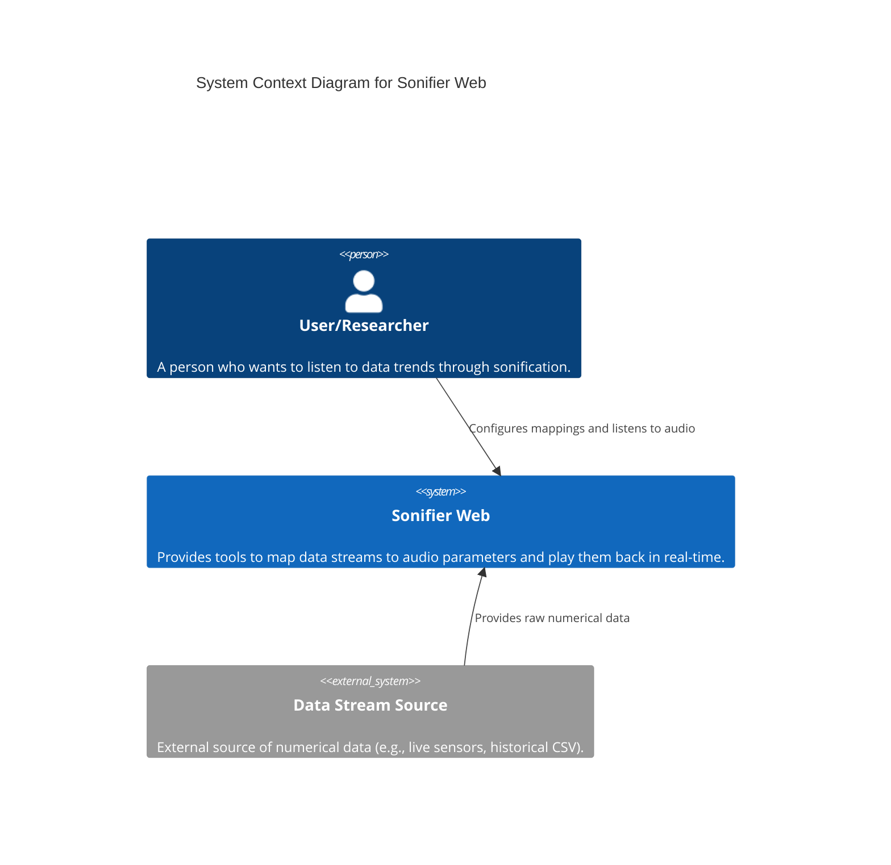
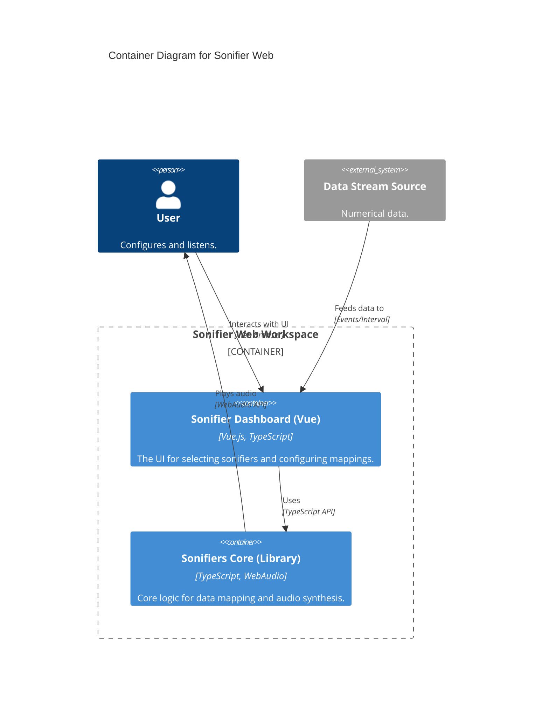

# Sonifier Web

A professional web-based sonification toolkit. This project provides a standalone library for real-time data sonification and a modular dashboard for configuring and testing various synthesizer engines.

## Project Structure

This is a monorepo managed with npm workspaces:

- **`packages/sonifiers-core`**: The heart of the toolkit. A zero-dependency, TypeScript library for mapping data to WebAudio synthesizers.
- **`packages/sonifier-app`**: A sample Vue 3 application that demonstrates the library's capabilities, including dynamic mapping, real-time data simulation, and multi-synth orchestration.

## Architecture

This project follows a modular architecture designed for real-time performance and framework independence.

### System Context



### Container Diagram



For a deeper dive into the internal components of the library, see the full [Architecture Documentation](./ARCHITECTURE.md).

## Features

- **Standardized Audio Engines**: Unified lifecycle and parameter interface for all synths (Liquid, Mallet, Purr).
- **Smart Data Mapping**: High-level `Runner` that handles normalization, statistical scaling (Mean/StdDev), and parameter orchestration.
- **Headless & UI Friendly**: The library is built to be easily integrated into any frontend framework or used headlessly in Node.js/Environments supporting WebAudio.
- **Professional Audio Quality**: Strict initialization rules and optimized synthesis algorithms prevent audible artifacts and ensure high-fidelity sonification.

## Getting Started

### Prerequisites

- Node.js (v18+)
- npm (v9+)

### Installation

```bash
# Clone the repository
git clone <this-repo-url>
cd sonifier-web

# Install dependencies for all workspaces
npm install
```

### Development

To start the sample application with real-time feedback from library changes:

```bash
npm run dev
```

This will build the `sonifiers-core` library and start the `sonifier-app` dev server.

### Building for Production

```bash
# Build both the library and the application
npm run build
```

## Usage (Core Library)

```typescript
import { library, Runner } from 'sonifiers-core';

// 1. Initialize a runner for a specific synth
const runner = await library.create('purr-synth');

// 2. Configure a dynamic mapping for a parameter
runner.nominate('purrRate', {
  type: 'dynamic',
  curve: 'linear',
  startRange: [0, 100]
});

// 3. Start audio
runner.start();

// 4. Feed your data stream
runner.feedAll(42.5);
```

## License

ISC
